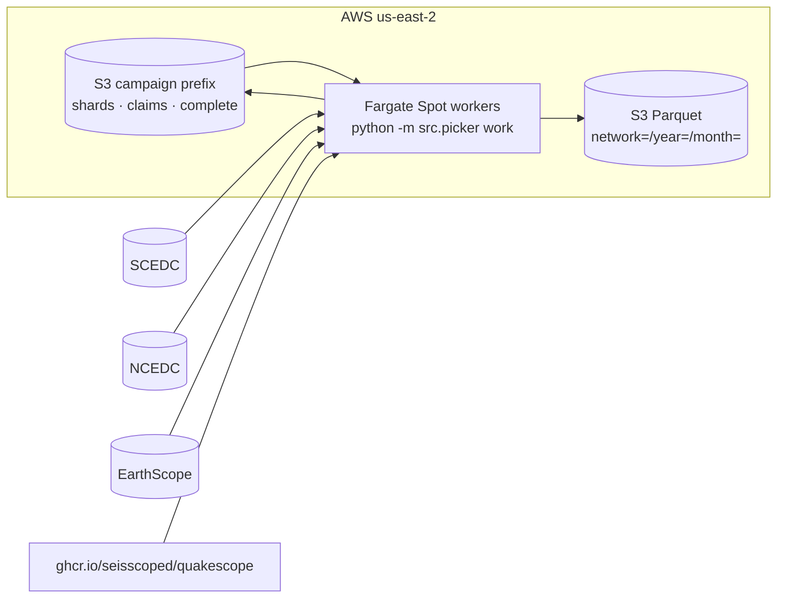

# QuakeScope 2026 — what works today

State of the picking workflow as of **2026-09-01**. Every number here names the
run it came from; anything unmeasured is in [OPTIMISE.md](OPTIMISE.md) instead.

Superseded documents are in [`archive/`](archive/), with a note on why each was
retired. Two of them are retracted rather than merely stale — read
[`archive/README.md`](archive/README.md) before citing anything there.

---

## The shape of it



**There is no database.** Work queue, claims, resume state, provenance and
output are all S3 objects under one campaign prefix. A campaign costs nothing
between runs and needs no VPC.

Workers claim shards with an S3 conditional write (`IfNoneMatch: "*"`), so two
workers can never take the same shard. A claim goes stale after `lease_hours`
without a manifest, which is what returns preempted work to the queue. Shape and
reasoning: the module docstring in
[`sb_catalog/src/s3_state.py`](../../sb_catalog/src/s3_state.py).

Why Fargate and not SkyPilot/EC2 — quota, cold start and measured throughput:
[16_skypilot_vs_fargate.md](16_skypilot_vs_fargate.md).

## What is provisioned

| | | verified |
|---|---|---|
| Bucket | `s3://quakescope-picks-2026`, us-east-2 | public access blocked, versioning off |
| Job queue | `niyiyu_earthscope_missing_station` | ENABLED / VALID |
| Compute env | `niyiyu_earthscope`, FARGATE_SPOT, maxvCpus 4000 | ENABLED |
| Job definition | **`quakescope_v3_worker:7`** | image `b8589aa`, 8 vCPU / 16 GB, 10 retries, `evaluateOnExit` retries Spot interruptions only, thread environment pinned to 2 |
| Campaign job definitions | `scedc:4`, `ncedc:4`, `earthscope:5`, `obs:4`, `western:5` | all on `b8589aa`, all with the thread environment set. Re-pinned 2026-09-02 — see below |
| Worker image | `ghcr.io/seisscoped/quakescope:b8589aa` | **535.6 MB compressed**, 9 layers |
| Task role | `SeisBenchBatchRole` | S3 write confirmed by policy simulation |
| EarthScope secret | `quakescope/earthscope-refresh-token` | injected as `ES_OAUTH2__REFRESH_TOKEN`; only the EarthScope and western job definitions carry it. Read back through boto3 and confirmed by policy simulation, 2026-09-01 |
| Cost alerts | `QuakeScopeAWSWatch`, hourly | [15_monitoring.md](15_monitoring.md) |

**Re-register the job definition whenever the image changes.** A campaign runs
whatever revision the job definition pins, and a stale pin is invisible until
you read worker logs — `:2` pinned a pre-fix image for eleven days and cost a
day of debugging. The image tag is the commit's short SHA.

**Register it with boto3, cloning the previous revision field by field.** The
`aws` CLI on this laptop is `aws-cli/2.0.34`, which neither reads nor writes
`platformCapabilities`, `executionRoleArn`, `networkConfiguration`,
`fargatePlatformConfiguration`, `secrets` or `evaluateOnExit`. A revision
registered through it comes out with none of them and cannot run on a Fargate
queue at all — `:5` was registered that way, failed submission with *"Job Queue
is attached to Compute Environment that can not run Jobs with capability EC2"*,
and was deregistered. Read revisions back through boto3 too; that CLI's output
is not evidence about any of those fields.

`submit-job` below is unaffected — the overrides it uses (`command`,
`environment`) long predate 2020. It is `register-job-definition` and
`describe-job-definitions` that are lossy.

**Re-pin every campaign definition, not just the worker.** On 2026-09-02 all
five were still on `f195222` — **55 commits and three days behind**, so they
predated the SIGTERM forwarding fix, the preemption exit code and both OOM
fixes. A campaign launched from any of them would have hit the `--procs > 1`
claim-stranding bug that destroyed two earlier measurements. **Every one also
had the thread environment unset**, which with their default `procs=4` is 4
processes x 8 threads on 8 vCPU — the configuration item 0 measured as *slower
than a single process*. Both are invisible in the console; only
`describe-job-definitions` through boto3 shows them.

New revisions are additive, so re-pinning is reversible: the old revision stays
ACTIVE and a submission can name it.

## The image is pulled 100k+ times, so it stays lean

`b8589aa` is **535.6 MB compressed in 9 layers**, down from 1,343.6 MB in 13 —
**2.51x, 808 MB less per pull**. Two changes did it, both to the base rather
than the package list:

| | |
|---|--:|
| `python:3.12` → `python:3.12-slim` | −365 MB (410.9 → 46.2, measured) |
| `pip --no-cache-dir` | the rest |

The slim base is safe because every dependency resolves to a manylinux wheel for
cp312 — 68 packages, zero sdists — so nothing is built from source and the
toolchain in the full image was never used.

**What cannot be removed**, though it looks removable: `matplotlib`, `pytz`,
`lxml`, `sqlalchemy`, `pillow` and `tqdm` all arrive transitively — `obspy`
requires `matplotlib`, `seisbench` requires `obspy`. Trimming past this point
means changing what the picker imports, not what the Dockerfile lists.

**There is no second image.** The dashboard runs on a GitHub Actions runner with
a plain `pip install`, `pages.yml` only uploads static files, and the tutorials
use the pixi environment — nothing automatic needs a container for plots.

## The five campaigns

Queues are **written and immutable**. Counts read back from S3
([21_queues_written.md](21_queues_written.md)) — use these, not the estimates in
`archive/12_output_storage.md`, which were 1.3–1.7× low because they did not
separate location codes.

| campaign | weight | stations | shards | station-days |
|---|---|--:|--:|--:|
| scedc | `jma_wc` | 1,128 | 8,479 | 4,106,669 |
| ncedc | `jma_wc` | 2,116 | 14,941 | 5,979,675 |
| earthscope | `jma_wc` | 51,846 | 153,208 | 67,983,975 |
| obs | `obs` | 3,389 | 6,566 | 996,536 |
| western | `original` | 24,113 | 72,505 | 33,799,828 |
| **total** | | | **255,699** | **112,866,683** |

Range 2010.001–2026.001. Weight rationale, thresholds and channel policy:
[17_launch_conventions.md](17_launch_conventions.md). Campaign definitions:
[11_launch_plan.md](11_launch_plan.md).

**The classifier is out of this run.** Submit without `--classifier`; the
reasoning is generalization, not a defect —
[../quakexnet_generalization_plan.md](../quakexnet_generalization_plan.md).

## Weights ship in the image

`jma_wc`, `obs`, `original` and `quakescope2026` are committed in
[`sb_catalog/models/v3/phasenet/`](../../sb_catalog/models/v3/phasenet/) and
copied straight in, so the build downloads no weights and cannot vary between
builds. Anything else SeisBench offers downloads on first use — fine ad-hoc,
never on a campaign path.

How to add one, and why the `.json` is the architecture rather than metadata:
[the top-level README](../../README.md#model-weights-and-the-container-image).

## Launching

```bash
# smoke test one shard first - always
aws batch submit-job --region us-east-2 \
  --job-name scedc-smoke --job-queue niyiyu_earthscope_missing_station \
  --job-definition quakescope_v3_worker:7 \
  --container-overrides '{
    "command":["work",
      "--campaign","s3://quakescope-picks-2026/scedc",
      "--weight","jma_wc","--procs","4","--max-shards","1","--profile"],
    "environment":[
      {"name":"OMP_NUM_THREADS","value":"2"},
      {"name":"MKL_NUM_THREADS","value":"2"},
      {"name":"OPENBLAS_NUM_THREADS","value":"2"},
      {"name":"NUMEXPR_NUM_THREADS","value":"2"},
      {"name":"VECLIB_MAXIMUM_THREADS","value":"2"}]}'
```

**`--procs` and the thread count must move together.** Left unset, torch
defaults to the core count, so raising `--procs` without lowering threads gives
8 processes x 8 threads on 8 vCPU and is *slower* than one process. `4 x 2` is
the measured optimum — [OPTIMISE.md](OPTIMISE.md) item 0.

`:7` and all five campaign definitions pin the five variables to 2, matching
their default `procs` of 4, so a submission that overrides nothing is already
correct. The block above is kept explicit because **any submission that changes
`--procs` must override them too** — and every definition before 2026-09-02 set
no thread environment at all. All five variables, not just `OMP_NUM_THREADS`,
because `amp.wood_anderson` threads through numpy/BLAS rather than torch.

Then look at the picks, not just the exit code. To scale, submit an array job;
workers are stateless, so adding more needs no cleanup and cancelling loses at
most one checkpoint interval per worker.

The campaign parameters (`campaign`, `weight`, `procs`, `checkpoint`) are
`Ref::` substitutions in the job definition — pass them via `parameters`, not
`containerOverrides.environment`, or submission fails with
*"No parameter found for reference campaign"*.

## Measured behaviour

**One SCEDC shard, `2010081-2010101-5b92deb2ff4b`, job `9b63303b`, 2026-09-01,
image `5c612f6`, `--procs 1` on 8 vCPU.** Exit 0, 2,037.7 s, 114,939 picks over
100 station-day-channels, 4,425 MB read.

| stage | seconds | per unit |
|---|--:|---|
| `amp.wood_anderson` | 1179.45 | 10.262 ms/pick |
| `model.classify` | 662.25 | |
| `s3.get` | 502.18 | 8.8 MB/s |
| `amp.velocity` | 192.62 | 1.676 ms/pick |
| `mseed.parse` | 28.40 | 155.8 MB/s |
| `parquet` encode+put | 0.40 | 0.002 ms/row |

Stages sum past 100% of wall clock because the pipeline overlaps I/O with
compute — they are not additive shares.

**Cost, extrapolated from that one shard:** 4.43 s per *planned* station-day
(only 100 of the shard's 460 planned station-days held data), giving
**~1.11M vCPU-hours and ~$16,400** at $0.0148/vCPU-hr, or **~$11,000** after the
1.50x from `--procs 4` / `OMP_NUM_THREADS=2` ([OPTIMISE.md](OPTIMISE.md) item 0).

> ⚠️ **Both figures above are superseded.** They apply SCEDC + `jma_wc`
> economics to all five campaigns, and 90% of the campaign is neither: EarthScope
> reads 1.88× cheaper per unit of work, and 31% of planned station-days use a
> weight costing 0.35× the inference. Rebuilt per campaign from node wall clock,
> the central estimate is **~$10,500 at a 40% hit rate, in a range of
> $5,100–$24,600** — see [24_cost_model.md](24_cost_model.md). It lands near
> ~$11,000 only because two large errors cancel; do not read that as
> confirmation.

**Two other measurements from 2026-09-01 revise this table.** EarthScope reads at
**90.3 MB/s**, 7.8x the same-day SCEDC control, so the `s3.get` line above is a
cross-region SCEDC property and not a pipeline problem (item 4). And
`amp.wood_anderson`'s 58% is shard-specific — it is 20% on EarthScope, where
`model.classify` is 69% (item 3).

**Treat it as one sample.** It is CI, in 2010, at `--procs 1`.

## Things that were fixed by running, not by reading

Recorded because they are the argument for the smoke-test discipline above.

- **The job definition pinned an eleven-day-old image.** Three commits bounding
  retry loops had landed and none were deployed, so workers hung 85 minutes in a
  loop that had already been fixed. Diagnosed from a log string that no longer
  exists in HEAD.
- **`jma_wc` was not in the image**, so every worker fetched 4.13 MB from
  `hifis-storage.desy.de` at startup — 1,500 cold-start requests to an external
  academic host in the critical path.
- **S3 cold-start burst**, not throughput, collapsed a 1,500-task fleet: every
  task's first act hit the same three prefixes in the same second. Steady state
  is 0.4 writes/s against a 3,500/s limit. Fixed with adaptive retries and an
  array-index stagger.
- Earlier, and in the same spirit: an inclusive end silently dropping the last
  day of every shard; the Parquet key defaulting to `HOSTNAME` so shards
  overwrote each other; a job reporting SUCCEEDED after failing every shard; a
  non-atomic stale-claim takeover; a planner overstating the campaign 4.2×.

## Reference

| | |
|---|---|
| [24_cost_model.md](24_cost_model.md) | **cost, rebuilt per campaign — supersedes every earlier figure** |
| [23_amplitude_review.md](23_amplitude_review.md) | WA taper, `wa_min_conf`, whole-day deconvolution |
| [11_launch_plan.md](11_launch_plan.md) | the five campaigns, networks, weights |
| [16_skypilot_vs_fargate.md](16_skypilot_vs_fargate.md) | platform decision, stage measurements, **and how to read either catalog** (§6) |
| [17_launch_conventions.md](17_launch_conventions.md) | weights, thresholds, channel policy, naming |
| [19_earthscope_access.md](19_earthscope_access.md) | two tiers, the `s3-miniseed-v2` role, credentials in the container |
| [21_queues_written.md](21_queues_written.md) | authoritative station-day counts |
| [15_monitoring.md](15_monitoring.md) | hourly watch, budgets, emergency stop |
| [20_fire_drill.md](20_fire_drill.md) | end-to-end rehearsal |
| [07_troubleshooting.md](07_troubleshooting.md) | common failures |
| [01_aws_basics.md](01_aws_basics.md), [04_batch_setup.md](04_batch_setup.md) | getting back into the account |
| [02_weights_and_container.md](02_weights_and_container.md) | weight provenance |

Reading the **2025** catalog (DocumentDB) and the **2026** catalog (Parquet):
[16_skypilot_vs_fargate.md §6](16_skypilot_vs_fargate.md).
