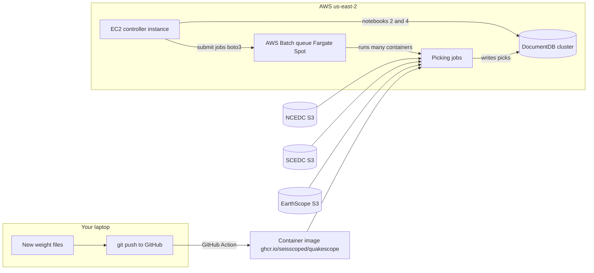

# QuakeScope 2026 re-run — master runbook

Goal: re-run the QuakeScope **picking** workflow with the **v7 phase-picker
weights** (`quakescope2026`) over three archives — **NCEDC**, **SCEDC**, and
**EarthScope S3** — using AWS Batch on Fargate Spot, writing picks to
DocumentDB.

> **Scope decision, 2026-08-17: the classifier is deferred for this run.**
> Submit picking jobs **without** `--classifier`. QuakeXNet stays in the image
> and everything below about its weights remains accurate, but it will not
> write labels into the 2026 catalog.
>
> The reason is generalization, not a defect. The model was trained on Pacific
> Northwest data, and out-of-region testing showed it is strongly dependent on
> where the arrival sits in the analysis window — agreement on a fixed set of
> Alaska events runs from 78% down to 16% on window placement alone, and the
> pipeline currently slides windows blindly with a 50 s stride. That is fixable
> and worth fixing, but not before a campaign. See
> [`../quakexnet_generalization_plan.md`](../quakexnet_generalization_plan.md)
> for the measurements and the plan, and
> [Akashkharita/pnw_seismic_event_detection#2](https://github.com/Akashkharita/pnw_seismic_event_detection/issues/2)
> for the upstream discussion.
>
> Picking is unaffected and proceeds as planned.

This folder is written for someone returning to AWS after a long break. Follow
the checklist top to bottom; each step links to a detailed guide. The
companion notebooks in [notebooks/](../../notebooks/) are still the executable
version of stages 1–4.

Background reading (optional refresher): the SCOPED HPS book
<https://seisscoped.org/HPS-book/intro.html>, in particular the *AWS 101*,
*S3*, and *Fargate/Batch* chapters.

---

## The big picture

- Each **Batch job** is one container that processes a block of
  **40 stations × 20 days** (the defaults in `submit_helper.py`). It streams
  miniSEED from S3, runs the phase picker + QuakeXNet classifier, and writes
  picks to DocumentDB.
- Hundreds of jobs run concurrently on **Fargate Spot** (cheap, interruptible;
  interrupted jobs retry automatically up to 10 times).
- **DocumentDB** (AWS's MongoDB) stores stations, picks, classifications, and
  a provenance record for every run.

## Two design rules for any re-run

1. **Weights live in this repository**, next to the existing ones
   (`sb_catalog/models/`). They are small (~0.3–3 MB), the GitHub Action
   bakes them into the container automatically on every push to `main`, and
   git records their provenance. Details in
   [02_weights_and_container.md](02_weights_and_container.md).
2. **Reuse the existing DocumentDB cluster, but write into a NEW database
   name inside it** (e.g. `quakescope2026`). Never write a re-run into a
   database that already holds a campaign: the workflow skips any station-day
   that already has a `picks_record` entry, so the re-run would skip almost
   everything. A new database name costs nothing extra and keeps the old
   catalog intact. Details in [03_documentdb.md](03_documentdb.md).

---

## Checklist

### Phase A — Get back into AWS (½ day) → [01_aws_basics.md](01_aws_basics.md)

- [ ] A1. Sign in to the AWS console; note your 12-digit **account ID**.
- [ ] A2. Set the console region to **us-east-2 (Ohio)** — everything lives there.
- [ ] A3. Create a fresh **access key** for yourself (old ones are likely dead).
- [ ] A4. `aws configure` on your laptop; verify with `aws sts get-caller-identity`.
- [ ] A5. Set a **billing budget alert** (e.g. $500/month) so a runaway campaign emails you.

### Phase B — New weights + container (½ day) → [02_weights_and_container.md](02_weights_and_container.md)

- [ ] B1. Drop the new QuakeXNet weights into `sb_catalog/models/v3/quakexnet/` (replace `base.pt.v1`).
- [ ] B2. Drop the new phase-picker weights into `sb_catalog/models/v3/phasenet/` as `<name>.pt.v1` + `<name>.json.v1` — all of them, if running several pickers (OBS / general / California): see [08_multi_picker_campaigns.md](08_multi_picker_campaigns.md).
- [ ] B3. Push to `main`; the GitHub Action builds `ghcr.io/seisscoped/quakescope`.
- [ ] B4. (Recommended) Test the image locally on one station-day.
- [ ] B5. Note the image's **short-SHA tag** — pin it in the job definition for reproducibility.

### Phase C — Database (½ day) → [03_documentdb.md](03_documentdb.md)

- [ ] C1. Check whether the DocumentDB cluster still exists (Console → DocumentDB). If deleted, restore from snapshot or create anew.
- [ ] C2. Start (or reuse) the **EC2 controller instance** in the same VPC/security group — DocumentDB is only reachable from inside the VPC.
- [ ] C3. Fill `DOCDB_ENDPOINT_URI` in `sb_catalog/src/parameters.py`.
- [ ] C4. Pick the new database name (e.g. `quakescope2026`) and populate **station metadata** (notebook 2).

### Phase D — Batch compute environment (½ day) → [04_batch_setup.md](04_batch_setup.md)

- [ ] D1. Check/create the IAM **job role** and **execution role**.
- [ ] D2. Create (or verify) the **Fargate Spot compute environment** (`maxvCpus` controls how many jobs run at once).
- [ ] D3. Create (or verify) the **job queue**.
- [ ] D4. Register the **picking job definition** — must be re-registered this time because it now takes `model`/`weight` parameters.
- [ ] D5. Fill the Batch names into `parameters.py`.

### Phase E — Smoke test, then scale (1 day + campaign) → [05_submitting_jobs.md](05_submitting_jobs.md)

- [ ] E0. Run the **tier-2 smoke test** — three stations, one day, checked against
      values measured locally → [10_tier2_smoke_test.md](10_tier2_smoke_test.md).
      Do this before E2: it separates "the infrastructure is wrong" from "the
      models are wrong", and it is an hour rather than a campaign.
- [ ] E1. Get a fresh **EarthScope token** (needed only for the EarthScope archive).
- [ ] E2. Submit **one small test job** (a few stations, a few days, one per archive).
- [ ] E3. Verify picks arrive in the new database and `sb_runs` records the new weight names (notebook 4).
- [ ] E4. Submit the real campaigns, archive by archive, year block by year block.
      The five-campaign split, network lists, weights and order are in
      [11_launch_plan.md](11_launch_plan.md).
- [ ] E5. Running different weights on different station sets (OBS picker, general picker, California picker)? Partition the networks and submit one campaign per weight → [08_multi_picker_campaigns.md](08_multi_picker_campaigns.md).
- [ ] E6. Stakeholder run with the original PhaseNet on a defined station set (western states), isolated from the science run → [09_western_states_run.md](09_western_states_run.md).

### Phase F — Monitor & finish → [06_monitoring.md](06_monitoring.md)

- [ ] F1. Daily: Batch console (running/failed counts), CloudWatch logs for failures, pick counts in the DB.
- [ ] F2. Weekly: Cost Explorer.
- [ ] F3. When done: stop the EC2 controller, scale the compute environment to 0, snapshot the database. Troubleshooting reference: [07_troubleshooting.md](07_troubleshooting.md).

> **Output format is under review.** At the launch's measured scale — about
> 52 million station-days and order 10^10 picks — DocumentDB storage is roughly
> 6.5x larger than Parquet for the same picks, and the unique index on `picks`
> becomes the throughput bottleneck. See
> [12_output_storage.md](12_output_storage.md) for the measurements and the
> recommended S3/Parquet layout, and
> [13_parquet_workflow.md](13_parquet_workflow.md) for running the campaigns
> against it. Note the picking job definition **no longer hardcodes**
> `--classifier` and must be re-registered.

> **v3 runs on SkyPilot, not Batch.** Fargate Spot, the job definitions and
> DocumentDB are replaced by SkyPilot managed jobs over an S3 work queue —
> see [14_skypilot.md](14_skypilot.md). Phases C and D below (DocumentDB,
> Batch compute environment) do not apply to a v3 campaign.

> **Amplitudes changed convention.** The Wood-Anderson constants were a mix of
> the Richter and IASPEI standards and are now IASPEI throughout, which shifts
> ML by a near-uniform +0.033 relative to the 2025 catalog. See
> [../amplitude_conventions.md](../amplitude_conventions.md) for what
> `amplitude` and `raw_amplitude` mean and why the deconvolution window is
> short — it is safe for Wood-Anderson and would not be for a Mw amplitude.

---

## A note on screenshots

The AWS console changes layout often, so these guides use exact navigation
breadcrumbs instead of screenshots, e.g. **Console → Batch → Job queues**.
The search bar at the top of the console is the fastest way to follow them:
type the service name ("Batch", "DocumentDB", "IAM") and hit enter. If
annotated screenshots are wanted for training others, capture them from a
signed-in session while walking through each phase.
